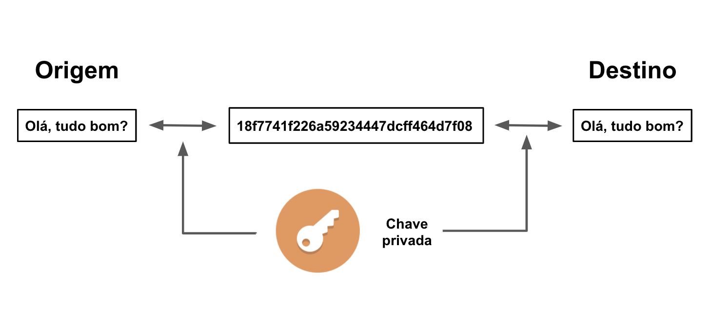
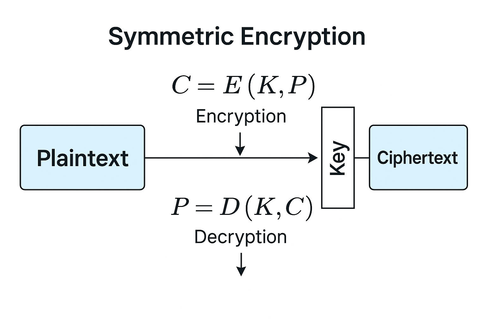

import Admonition from '@theme/Admonition';

# Criptografia Simétrica


Imagine um cofre. Agora imagine que você e outra pessoa usam exatamente a mesma chave para trancar e destrancar esse cofre. Essa é a base da criptografia simétrica, ou como também é chamada: criptografia de chave secreta.Ela é simples e eficiente mas se mal utilizada, é desastrosa.


## 1. O que é Criptografia Simétrica?

A criptografia simétrica é um método de segurança que usa uma única chave para realizar duas operações inversas: cifrar (criptografar) e decifrar (decriptografar) dados.

Essa chave precisa ser mantida em sigilo por ambas as partes. Se ela for interceptada, tudo está comprometido. Ao contrário da criptografia assimétrica, onde as chaves são diferentes e têm papéis distintos, aqui temos apenas uma: quem tem a chave, tem tudo.

A criptografia simétrica é frequentemente considerada menos segura do que a assimétrica, em grande parte porque depende da troca segura de chaves e do gerenciamento meticuloso de chaves. Qualquer pessoa que intercepte ou obtenha a chave simétrica pode acessar os dados.Por esse motivo, organizações e aplicativos de mensagens dependem cada vez mais de um método de criptografia híbrida que usa criptografia assimétrica para distribuição segura de chaves e criptografia simétrica para trocas de dados subsequentes. 

Além disso, como os avanços na inteligência artificial (IA) e na computação quântica ameaçam desfazer os métodos tradicionais de criptografia, muitas organizações dependem de soluções integradas para proteger dados confidenciais. 


<p style={{textAlign: 'center'}}> Diagrama Criptografia Simétrica</p>

<div style={{textAlign: 'center'}}>
    
</div>
<p></p>

<Admonition type="info" title="Exemplo Clássico: Alice e Bob">
Imagine que Alice queira enviar um documento confidencial para Bob. Nesse cenário, a criptografia simétrica funcionaria da seguinte maneira:

- Alice e Bob estabelecem uma chave secreta ou usam a criptografia assimétrica para uma troca segura de chaves.

- Alice criptografa o documento usando a chave secreta, transformando-o em um texto cifrado ilegível.

- Alice envia o texto cifrado para Bob.

- Ao receber o documento criptografado, Bob usa a mesma chave secreta para descriptografá-lo de volta à sua forma original, garantindo a confidencialidade durante a transmissão. 
</Admonition>

A criptografia simétrica envolve dois tipos principais de cifras simétricas: cifras de bloco e cifras de fluxo.

### Cifras de bloco
Cifras de bloco, como o padrão de criptografia avançada (AES), criptografam dados em blocos de tamanho fixo.
Cifras de bloco processam blocos de dados de tamanho fixo. O mais conhecido é o AES (Advanced Encryption Standard), que processa blocos de 128 bits usando chaves de 128, 192 ou 256 bits.

**Estrutura do AES**

O AES aplica múltiplas rodadas de transformação, incluindo:

SubBytes – substituição não linear (S-box)

ShiftRows – permutação das linhas do bloco

MixColumns – transformação linear por multiplicação de matrizes em GF(2⁸)

AddRoundKey – operação XOR com a subchave da rodada

Essa estrutura cria uma difusão e confusão significativas — dois princípios fundamentais de segurança de cifras modernas (definidos por Claude Shannon).

Se quiser aprofundar mais sobre o AES pode ver por [aqui](https://nvlpubs.nist.gov/nistpubs/FIPS/NIST.FIPS.197-upd1.pdf)

---

### Cifras de fluxo
Cifras de fluxo, como o RC4, criptografam dados de um bit ou byte de cada vez, o que os torna adequados para processamento de dados em tempo real.
Cifras de fluxo (stream ciphers) funcionam bit a bit ou byte a byte, usando uma sequência pseudoaleatória gerada a partir da chave.

**Estrutura ChaCha20**

ChaCha20 usa adições, rotações e XORs (ARX) em palavras de 32 bits para produzir um fluxo pseudoaleatório de alta entropia. Cada byte da mensagem original é combinado com o fluxo via XOR.

Ideal para comunicações em tempo real (VoIP, streaming, IoT), porque é leve, paralelizável e resistente a ataques por canal lateral.
Os usuários frequentemente usam cifras de bloco para garantir a integridade e a segurança de grandes quantidades de dados. As cifras de fluxo são usadas para criptografar fluxos de dados menores e contínuos de forma eficiente, como comunicações em tempo real.  

Se quiser aprender mais sobre o  ChaCha20 , pode olhar [aqui](https://www.tutorialspoint.com/cryptography/cryptography_chacha20_encryption_algorithm.htm)

### Problemas da Criptografia Simétrica
Quando estiver usando esse tipo de criptografia é importante fazer as seguintes perguntas:

- Como enviar a chave de forma segura?

- Como rotacionar chaves sem quebrar o sistema?

- Como proteger a chave em repouso?

- Como impedir que a chave vaze para logs, caches, builds?

Se alguém interceptar ou roubar a chave, ele não precisa quebrar o algoritmo. **até porque essa pessoa já tem o segredo.**

É por isso que empresas e aplicações adotam criptografia híbrida: usam criptografia assimétrica para a troca segura da chave simétrica. A chave real dos dados, portanto, nunca transita abertamente por canais inseguros.

## 2. Fundamentos Teóricos

A criptografia simétrica é o modelo mais antigo de criptografia documentada. Já era usada no Egito antigo em inscrições cifradas. Na era moderna, evoluiu da substituição monoalfabética (César) para cifras polialfabéticas (Vigenère) e, finalmente, para algoritmos computacionais robustos como o DES (1975) e o AES (2001).

Ainda hoje, ela é usada em quase tudo: de seu app de banco a VPN.

Matematicamente, o processo é definido por duas funções:

<p style={{textAlign: 'center'}}> Funções Criptografia Simétrica</p>

<div style={{textAlign: 'center'}}>
    
</div>
<p></p>

_E(K, P) = C → Cifra: o texto claro M é cifrado com a chave K para gerar o texto cifrado C._

_D(K, C) = P → Decifra: o texto cifrado C é decifrado com a mesma chave K para recuperar o texto original M._

Onde:

**K:** chave secreta

**P:** mensagem em texto claro (plaintext)

**C:** mensagem cifrada (ciphertext)

Ambas as partes precisam conhecer e proteger K. A segurança da criptografia simétrica depende exclusivamente da confidencialidade da chave.

## 3. Aplicações 

**Comunicação segura e navegação na web**

As organizações usam muito a criptografia simétrica para proteger os canais de comunicação. Protocolos como o Transport Layer Security (TLS) usam criptografia simétrica para proteger com eficiência a integridade e a confidencialidade dos dados transmitidos pela internet, incluindo e-mails, mensagens instantâneas e navegação na web. 

Durante um handshake SSL/TLS, o cliente obtém a chave pública do site a partir de seu certificado SSL/TLS para estabelecer uma chave de sessão segura, enquanto o site mantém sua chave privada em segredo.

O handshake inicial usa a criptografia assimétrica para trocar informações e estabelecer uma chave de sessão segura antes de fazer a transição para a criptografia simétrica, para uma transmissão de dados mais eficiente. Essa combinação garante que os dados confidenciais permaneçam privados e invioláveis durante a transmissão. 

---
**Segurança na nuvem**

Enquanto os provedores de serviços de nuvem (CSPs) são responsáveis pela segurança da nuvem, os clientes são responsáveis pela segurança na nuvem, incluindo a segurança de quaisquer dados. 

A criptografia de dados em toda a empresa pode ajudar as organizações a proteger seus dados confidenciais tanto localmente quanto na nuvem, garantindo que dados roubados permaneçam inacessíveis sem a chave de criptografia, mesmo se ocorrer uma violação de dados. 

Pesquisas recentes indicam que, atualmente, a maioria das organizações emprega uma infraestrutura de criptografia híbrida por meio de soluções criptográficas baseadas na nuvem e locais.2

---
**Criptografia de banco de dados**

Os bancos de dados geralmente armazenam grandes quantidades de informações confidenciais, desde informações pessoais até registros financeiros. A criptografia simétrica pode ajudar a criptografar esses bancos de dados ou campos específicos dentro deles, como números de cartão de crédito e previdência social. 

Ao criptografar dados em repouso, as organizações podem garantir que os dados confidenciais permaneçam protegidos, ainda que o banco de dados esteja comprometido. 

---
**Integridade dos dados**

Os algoritmos de criptografia simétrica não apenas garantem a confidencialidade, como também a integridade dos dados, um fator crítico nas transações financeiras. Ao gerar códigos de autenticação de mensagem (MACs), as chaves simétricas podem ajudar a confirmar que ninguém alterou os dados durante a transmissão. 

As funções de hash também desempenham um papel importante na verificação da integridade dos dados. Elas geram um valor de hash de tamanho fixo a partir dos dados de input. Essas "impressões digitais" podem ser comparadas antes e depois da transmissão. Se o hash mudou, isso significa que ele foi adulterado.

## 4. Algoritomos de Criptografia Simétrica

Os algoritmos de chave simétrica mais conhecidos incluem: 

- Padrão de criptografia de dados (DES) e Triple DES (3DES)

- Padrão de criptografia avançada (AES)

- Twofish

- Blowfish  

### Padrão de criptografia de dados (DES) e Triple DES (3DES)
A IBM apresentou o DES pela primeira vez na década de 1970 como o algoritmo de criptografia padrão, função que desempenhou por muitos anos. No entanto, seu comprimento de chave relativamente curto (56 bits) o tornava vulnerável a ataques de força bruta, em que agentes de ameaças tentam diferentes chaves até encontrar uma que funcione.

O Triple DES, desenvolvido como um aprimoramento, aplica o algoritmo DES três vezes a cada bloco de dados, aumentando de forma significativa o tamanho da chave e a segurança geral. 

Por fim, algoritmos simétricos mais seguros substituíram tanto o DES quanto o Triple DES.  

### Padrão de criptografia avançada (AES)
O AES é geralmente é considerado a melhor opção entre os algoritmos de criptografia simétrica. É amplamente adotado por organizações e governos em todo o mundo, incluindo o governo dos EUA. O AES oferece segurança forte, com comprimentos de chave de 128, 192 ou 256 bits. Comprimentos de chave maiores são mais resistentes à quebra.  

O AES-256, que usa uma chave de 256 bits, é conhecido por seu alto nível de segurança e é usado com frequência em situações altamente sensíveis. O AES também é muito eficiente em implementações de software e hardware, o que o torna adequado para uma ampla gama de aplicações.

### Twofish
O Twofish é uma cifra de blocos de chaves simétrica conhecida por sua velocidade e segurança. Ele opera em blocos de dados com um tamanho de bloco de 128 bits e é compatível com comprimentos de chave de 128, 192 ou 256 bits. 

O Twofish é de código aberto e resistente à criptoanálise, o que o torna uma opção confiável para aplicações seguras. Sua flexibilidade e desempenho são adequados para implementações de software e hardware, especialmente quando a segurança e o desempenho são essenciais. 

### Blowfish
O Blowfish é uma cifra de blocos de chave simétrica projetada para fornecer uma boa taxa de criptografia em software, além de criptografia segura de dados. Ele suporta comprimentos de chave de 32 a 448 bits, o que o torna flexível e adequado para várias aplicações. 

O Blowfish é conhecido por sua velocidade e eficácia, sendo especialmente popular para criptografia de software. Ele também é muito popular em aplicações que precisam de um algoritmo de criptografia simples e rápido, embora algoritmos mais recentes, como o Twofish e o AES, o tenham substituído na maioria dos casos de uso.

## 5. Exemplo Pŕatico
**Criptografia Simétrica com Python (AES-GCM)**

Vamos cifrar e decifrar um dado usando AES em modo GCM.

```python
from cryptography.hazmat.primitives.ciphers.aead import AESGCM
import os

# Geração de chave de 256 bits (32 bytes)
key = AESGCM.generate_key(bit_length=256)
aesgcm = AESGCM(key)

# Geração de nonce (vetor de inicialização), deve ser único por mensagem
nonce = os.urandom(12)

# Dados que serão cifrados
plaintext = "Este é um dado sensível".encode("utf-8")
associated_data = b"dados autenticados"  # ainda pode ser byte literal, pois é ASCII puro

# Cifrar
ciphertext = aesgcm.encrypt(nonce, plaintext, associated_data)

# Decifrar
decrypted = aesgcm.decrypt(nonce, ciphertext, associated_data)

print("Texto original:", plaintext.decode("utf-8"))
print("Texto cifrado:", ciphertext)
print("Texto decifrado:", decrypted.decode("utf-8"))
```
<Admonition type="tip" title="Exercício 1 — Aplicação ">
 Já que vocês estão estudando sobre aplicações WEB, procurem por criptografias que podem ser aplicadas no projeto de vocês, então:

 - Como proteger o banco de dados?

 - Como proteger as senhas?

 - O que mais pode ser encriptografado para assegurar a [LGPD](https://youtu.be/oFRROvMVUWQ)?

</Admonition>

## Referências 

https://www.ibm.com/br-pt/think/topics/symmetric-encryption
