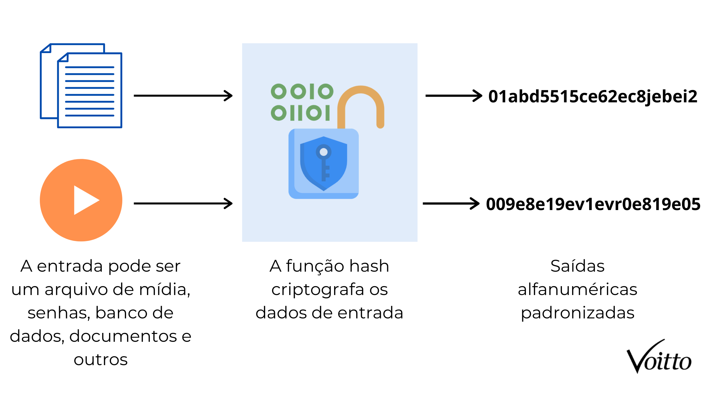

import Admonition from '@theme/Admonition';

# Hash Criptográfico: A Impressão Digital da Informação
_Imagine que você tem um documento e deseja criar uma "impressão digital" única para ele. Essa é a função de uma função hash: transformar dados de tamanho variável em uma sequência fixa de caracteres, geralmente representada em hexadecimal._

## 1. O que é hash?
Uma função hash é uma função matemática que transforma qualquer entrada (de qualquer tamanho) em uma saída de tamanho fixo, chamada de hash, resumo, ou _digest_. O hash representa a identidade única da entrada, como uma impressão digital.

Vamos supor que você quer garantir que um arquivo não foi alterado, ou armazenar senhas de usuários sem precisar guardar as senhas reais. Em ambos os casos, você pode usar funções hash criptográficas.

_Se a entrada muda, mesmo que em um único caractere, o hash resultante será completamente diferente. Isso é chamado de efeito avalanche._


<p style={{textAlign: 'center'}}> Diagrama  Hash </p>

<div style={{textAlign: 'center'}}>
    
</div>
<p></p>


As funções de hash aplicam uma série de operações matemáticas à entrada, produzindo um valor final fixo. O tamanho do hash depende do algoritmo utilizado (ex: 256 bits para SHA-256, 512 bits para SHA-512).


<Admonition type="info" title="Pense como na imagem acima:">

**Entrada:** um dado de qualquer tipo (texto, arquivo, imagem).

**Processamento:** algoritmo de hash aplica operações matemáticas (bitwise, deslocamentos, compressões).

**Saída:** um valor fixo (por exemplo, 64 caracteres hexadecimais em SHA-256).

exemplo:

Para você ter uma noção, o hash da palavra "echosec" utilizando a função Sha-256 é: _7DB9CD9202BBC13EA24453530EEAAA6D916BF4D47953D54282122AFA9EA618EB._

</Admonition>

### 1.1 Características

Além do mais, o hash tem algumas características:

**Unidirecional**

Essa propriedade diz respeito à não invertibilidade desse tipo de função. Ou seja, deve ser praticamente impossível pegar um valor de hash, aplicar uma função inversa e obter o dado de entrada.

É dito que é praticamente impossível porque pode haver a possibilidade de se encontrar o dado de entrada, porém a probabilidade é muito pequena.

A mesma ideia acontece com as funções que tentam descriptografar um hash. Elas tentam achar o valor de entrada, mas se torna um trabalho muito difício, ~e na maioria das vezes burro~ à medida que a complexidade da criptografia aumenta, o que torna a função praticamente invertível.

---

**Resistência à segunda pré-imagem**

A resistência à segunda pré-imagem significa que não podem existir dois valores de entrada com a mesma saída. Mesmo em dados "semelhantes" isso não ocorre. Observe o hash dessas duas palavras:

_echosec: 7DB9CD9202BBC13EA24453530EEAAA6D916BF4D47953D54282122AFA9EA618EB._

_Echosec: D40A1B00F982BA05ADB12391C398BEA2BBD977F2476E3C9977C7935AAC2C7D14._

Mesmo a informação sendo "igual", as saídas apresentam diferentes valores de hash.

Se quiserem tirar a prova, acessem [esse site](https://www.convertstring.com/pt_BR/Hash/SHA256) e insiram as palavras "echosec" e "Echosec" para validar o hash.

---

### 1.2 Hash x Encriptação(Não é a mesma coisa!)

Os dois processos são totalmente diferentes então não os confundam de forma alguma.

Resumo do google:
_"Criptografia é uma técnica de segurança que permite codificar informações de forma que só possam ser lidas por quem tem a chave para decifrar o código. A encriptação é um processo específico dentro da criptografia, que consiste em transformar um texto claro (que é legível) num texto cifrado (ilejível)."_

A encriptação é o processo de transformar texto ou dados (o chamado plaintext) num conjunto de dados cifrados (ciphertext), que pode ser desencriptado por quem tiver a chave necessária. Ao desencriptar, o recetor da mensagem acede ao conjunto de dados original.

E o que é criptografia hash? Como vimos, o hashing transforma o mesmo pedaço de texto ou dados, não em dados cifrados mas num código único. O código identifica o conjunto de dados original, mas não consegue “transformar-se” em texto legível; não serve para aceder à mensagem original.

O hashing é normalmente usado para assegurar a integridade dos dados, principalmente se se tratar de grandes quantidades, mas não permite aceder ao conteúdo de uma mensagem. Já a encriptação, ao invés, esconde mas também permite aceder ao conteúdo da mensagem (assim se tenha a chave).

Pense no hashing como uma espécie de lacre de cartas em formato digital, mas com uma grande diferença. Enquanto o lacre intacto era sinal de que a carta não tinha sido violada, o hash também assegura que uma comunicação se mantém sem alterações desde o momento em que foi criada – só que nem sequer permite ler a carta.

### 1.3 Algoritmos utilizados

Os algoritmos mais utilizados para realizar as funções hash já são alguns conhecidos de vocês:

- **Message Digest (MD):** essa função tem foco na verificação da integridade de arquivos. As versões mais comuns são: MD2, MD3, MD4 e MD5.

- **Secure Hash Function** (SHA): utilizada em transmissão de dados entre servidor e cliente, e utilizado no exemplo acima, o SHA-256.

- **RIPEMD:** é uma versão melhorada das funções MD. As saídas do RIPEMD possuem 160 bits de tamanho, já as saídas MD possuem 128 bits;

- **Whirlpool:** é um algoritmo de criptografia de código livre desenvolvido por dois professores (um do Brasil e outro da Bélgica). Esse algoritmo é usado pela Organização Internacional de Padronização (ISO) e pela Comissão Eletrotécnica Internacional (IEC).

### 1.4 Problemas do hash
Como nem tudo é perfeito, nosso caro hash também tem seus problemas, tal qual as criptografias que vocês aprenderam até agora:

**Colisão**

Uma colisão ocorre quando duas entradas diferentes produzem o mesmo valor hash. Isso não deveria acontecer, mas pode — principalmente em funções de hash obsoletas como MD5 e SHA-1, ou seha, em alguns casos (esperamos que raros), as chaves podem usar valores hash idênticos. 

Isto pode resultar na chamada colisão hash. Uma característica para avaliar um algoritmo é perceber quão resistente a colisões consegue ser. Uma colisão é uma vulnerabilidade que pode ser aproveitada por hackers e pessoas mal intencionadas. Para que algoritmo hash seja considerado bom deve ser complexo o sufuciente  para evitar colisões.

Para evitar isso, normalmente é utilizado o **SALT**, então pense só, quando dois usuários escolhem a mesma senha, o hash gerado será exatamente igual — se não usarmos um salt.

O salt é  um valor aleatório que é concatenado à senha antes de aplicar a função hash. Isso faz com que, mesmo com a mesma senha, o hash final seja diferente.

na prática, Bancos de dados de usuários, por exemplo, devem armazenar:

- hash_senha = hash(salt + senha)

- salt (único por usuário)

---

**Velocidade**

Por mais estrando que isso possa parecer, sim, a velocidade pode ser um problema dependendo do atacante e do algoritmo que você está utilizando.

Funções como SHA-1 e SHA-256 foram desenvolvidas para serem rápidas. E isso é ótimo quando estamos verificando a integridade de arquivos. Isso porque a velocidade também ajuda um atacante que tenha , por exemplo, placas de vídeo (GPUs) porque hoje é possível testar bilhões de hashes por segundo.

Um atacante com uma RTX 3080 consegue testar cerca de 360 mil milhões de hashes SHA-256 por segundo. Se as senhas forem curtas (ex: 8 caracteres alfanuméricos), ele pode quebrar todas as combinações em minutos.

Por isso, é recomendado usar hashes lentos como bcrypt, scrypt ou Argon2 em senhas. Eles foram criados especificamente para tornar ataques por força bruta mais caros.

## 2. Aplicações do Hash

O hashing é usado em diversas situações nas quais é importante perceber se determinada mensagem, conteúdo ou pacote de dados foi adulterado ou modificado em relação a um momento anterior. 

---
**Verificação de integridade em arquivos**

Quando você faz download ou envia arquivos, a função hash garante que o conteúdo recebido é exatamente o mesmo que foi enviado — sem alterações, corrupção, vírus ou injeções maliciosas. Se o hash calculado no destino for diferente do original, algo foi alterado.

---

**Assinaturas digitais**
As assinaturas digitais utilizam funções hash para garantir a autenticidade e a integridade de um documento. Em vez de assinar o documento inteiro, assina-se o hash — o que torna o processo muito mais eficiente e seguro.

Leiam [esse artigo](https://www.proofpoint.com/au/threat-reference/digital-signature), tafera obrigatória em.

---
**Verificação de senhas**
Em vez de armazenar senhas em texto puro, os sistemas armazenam seus hashes. No login, a senha digitada pelo usuário é convertida em hash e comparada com o hash salvo. Se coincidirem, o acesso é concedido.

---
**Criptomoedas e blockchain**
Funções hash são fundamentais na estrutura das criptomoedas. Elas garantem a segurança das transações, protegem contra fraudes e ajudam a prevenir ataques como DDoS. Além disso, os hashes ligam blocos entre si, formando uma cadeia imutável — qualquer tentativa de modificar uma transação altera o hash e quebra a cadeia.

<details>
<summary><b>Aprofundando sobre Blockchain</b></summary>

Blockchain é uma tecnologia aplicada principalmente no registro de transações envolvendo moedas digitais, como o bitcoin.

O blockchain é uma cadeia de blocos de dados criptografados. E adivinha quem é a função envolvida na criptografia desses dados? estamos falando do hash nesse material.

Dentro da rede dessa cadeia de blocos, existem pessoas que fornecem capacidade computacional para que as transações financeiras sejam registradas e validadas, ou seja, verificar o nível de honestidade das informações dentro do bloco, evitando fraudes.

Os usuários mineram a rede, registrando as transações e gerando um hash seguro.

<p style={{textAlign: 'center'}}> Diagrama  Hash </p>

<div style={{textAlign: 'center'}}>
    
</div>
<p></p>

Um detalhe interessante: um bloco recebe informações durante um tempo de aproximadamente 10 minutos. Depois disso, ele é criptografado utilizando o hash de um bloco validado na rede. Dessa forma, os novos blocos estão "ligados" aos blocos antigos, formando a cadeia.

Se quiserem aprofundar, recomendo que leia [esse artigo da IBM](https://www.ibm.com/br-pt/topics/blockchain)
</details>

## 3. Algoritmos de hash comuns
Como já falamos da maiora dos algoritmos vou deixar uma tabela para vocês:

| Algoritmo   | Tamanho  | Situação atual      | Usos típicos                     |
| ----------- | -------- | ------------------- | -------------------------------- |
| **MD5**     | 128 bits | Obsoleto e inseguro | Histórico e não recomendado      |
| **SHA-1**   | 160 bits | Obsoleto e inseguro | Assinaturas antigas, SSL legados |
| **SHA-256** | 256 bits | Seguro              | Blockchain, TLS, integridade     |
| **SHA-3**   | Variável | Seguro              | Substituto moderno do SHA-2      |
| **Bcrypt**  | Variável | Seguro (lento)      | Armazenamento de senhas          |
| **Argon2**  | Variável | Padrão moderno      | Armazenamento seguro de senhas   |

Detalhando os algoritmos que não falei ainda:

<details>
<summary><b>Bcrypt</b></summary>

O bcrypt é um algoritmo de hash criado em 1999, baseado no cifrador Blowfish, mas adaptado especificamente para o armazenamento de senhas. Seu diferencial é que ele incorpora um salt automaticamente e permite ajustar a dificuldade do processamento por meio de um parâmetro chamado "cost" (ou fator de trabalho).

**Como funciona?**

- O bcrypt gera um salt de 128 bits de forma automática.

- Aplica o algoritmo Blowfish expandido com o salt e a senha como input.

- Repete o processo 2^cost vezes (por exemplo, com cost=12, repete 4096 vezes).

- Gera uma saída de 192 bits (geralmente codificada em base64).

**Vantagens**

- Resistente a [rainbow tables](https://tisec.com.br/o-que-sao-ataques-de-rainbow-table/) (por conta do salt embutido).

- Dificuldade configurável, podendo acompanhar o aumento do poder computacional.

- Amplo suporte em frameworks de autenticação web.

**Problemas**

- Mais antigo, não foi projetado com ataques por GPU/FPGA em mente.

- Consome muita CPU, mas quase nenhuma RAM, o que permite ataques paralelos com hardware moderno.

</details>

<details>
<summary><b>Argon2</b></summary>

O Argon2 é o algoritmo vencedor da competição Password Hashing Competition (PHC), promovida em 2015 para escolher o sucessor moderno do bcrypt e scrypt.

Ele foi projetado especificamente para ser resistente a ataques com hardware especializado, como GPUs e ASICs, ao utilizar grandes quantidades de memória além de tempo de processamento.

**Como funciona?**

- Usa uma senha, um salt e parâmetros configuráveis: tempo, memória e paralelismo.

- Preenche uma matriz de memória com blocos derivados da senha.

- Aplica operações não lineares sobre a matriz por várias iterações.

- Produz o hash final com base no estado da matriz.

**Vantagens**

- Alta resistência a ataques paralelos com GPU.

- Customização total: mais memória = mais segurança.

- Recomendado oficialmente pelo OWASP para armazenamento de senhas.

**Problemas**

- Ainda não suportado nativamente em todas as linguagens ou frameworks antigos.

- Algoritmo mais complexo (mas vale o custo em segurança).
</details>

<Admonition type="caution" title="Importante!">
Para senhas, prefira Bcrypt, scrypt ou Argon2, que são lentos de propósito — dificultando ataques de dicionário e força bruta.
</Admonition>

## 4. Exemplo Prático

Imagine que você tem um sistema de login. O que nunca deve acontecer é guardar a senha pura no banco de dados. Em vez disso:

- Quando o usuário cria a conta, o sistema gera um hash da senha.

- Ao logar, o usuário envia a senha;

- O sistema gera o hash e compara com o armazenado. Se bater, deu certo, caso contrário "Senha inválida"

Exemplo com js e node.js, rodem na máquina de vocês:

não se esqueça de baixar as bibliotecas: 
```
npm install bcrypt

```

```js
const readline = require("readline");
const bcrypt = require("bcrypt");

const rl = readline.createInterface({
  input: process.stdin,
  output: process.stdout
});

// Simulando uma senha cadastrada
const senhaOriginal = "Echosecisverynice";
let hashSalvo;

// Cadastro: gerar hash da senha
bcrypt.hash(senhaOriginal, 10).then((hash) => {
  hashSalvo = hash;
  console.log("Hash gerado e armazenado com sucesso.");
  console.log(hash);

  rl.question("\n Digite sua senha para verificar: ", function (entrada) {
    bcrypt.compare(entrada, hashSalvo).then((resultado) => {
      if (resultado) {
        console.log("\n✅ Acesso concedido!");
      } else {
        console.log("\n❌ Senha incorreta.");
      }
      rl.close();
    });
  });
});

```

<Admonition type="tip" title="Exercício 1 — Aplicação ">
Aproveitando que estão trabalhando com aplicação Web, quem quiser mostrar no próximo encontro, um login utilizando algumas dessas funções hash, recomendo que apliquem no projeto de vocês:

Isso é cybersecurity na prática!

</Admonition>