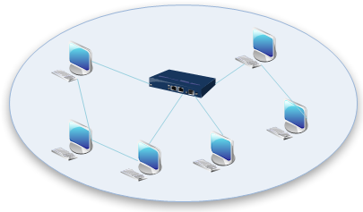
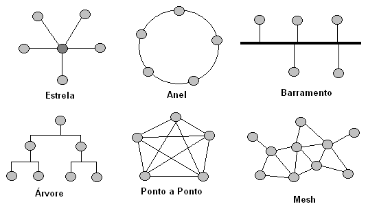

## 1. Topologia de Redes

A topologia de rede descreve a forma como os dispositivos estão organizados e interconectados em uma rede de computadores. Isso inclui tanto a disposição física dos cabos e equipamentos (topologia física), quanto a forma como os dados circulam entre os dispositivos (topologia lógica).

Uma compreensão sólida das topologias é essencial para qualquer profissional de redes e segurança, pois ela impacta diretamente o desempenho, a escalabilidade, a tolerância a falhas e as estratégias de proteção contra ataques.

 Topologia de rede 

    

---

## 2. Tipos de Topologia(Física vs Lógica)
 
Topologia física refere-se à configuração real dos meios de transmissão (cabos, conectores, equipamentos).

Topologia lógica descreve o caminho que os dados percorrem, independentemente da disposição física.

Por exemplo, em uma rede com dispositivos ligados fisicamente a um switch (topologia física em estrela), o tráfego pode se comportar logicamente como uma topologia em barramento se o meio for compartilhado (como no Wi-Fi ou em hubs antigos).

## 3. Principais Topologias

### 3.1 Topologia em Barramento (Bus)

Barramento  

    

Todos os dispositivos compartilham um único meio de transmissão linear (um "barramento").

Um cabo único conecta todos os dispositivos. Os dados trafegam em ambas as direções, e cada dispositivo verifica se a mensagem é destinada a ele.

**Vantagens:**

- Simples e barata para redes pequenas.

- Fácil de implementar.

**Desvantagens:**

- Pouca escalabilidade.

- Um problema no cabo pode derrubar toda a rede.

- Baixa segurança: qualquer nó pode escutar o tráfego.

**Aplicações:** redes legadas Ethernet 10Base2 e 10Base5. Hoje, está obsoleta para ambientes corporativos.

---

### 3.2 Topologia em Estrela (Star)

Estrela  

    

Todos os dispositivos são conectados a um ponto central, como um switch ou hub. O equipamento central recebe os dados e os redireciona ao destino correto.

**Tecnologias típicas:** Ethernet com switches (IEEE 802.3), Wi-Fi com Access Points (IEEE 802.11)

**Vantagens:**

- Fácil de expandir.

- Falhas em um cabo afetam apenas o dispositivo conectado.

- Boa segurança e controle centralizado.

**Desvantagens:**

- Se o ponto central falhar, a rede inteira é comprometida.

- Custo mais elevado por exigir mais cabeamento.

**Aplicações:** amplamente utilizada em redes corporativas, residenciais, laboratórios e datacenters.

---
### 3.3 Topologia em Anel (Ring)

Ring 

    

Cada dispositivo é conectado a outros dois, formando um círculo. Os dados circulam em um sentido (anel simples) ou em ambos (anel duplo).Um token (sinal especial) circula pela rede e controla o direito de transmitir.(isso aqui é uma brisa que tu pode entender melhor [aqui](https://www.lenovo.com/br/pt/glossary/what-is-ring-topology/)). **Protocolos históricos:** Token Ring (IEEE 802.5), FDDI (Fiber Distributed Data Interface)

**Vantagens:**

- Evita colisões de dados.

- Previsibilidade no tráfego.

**Desvantagens:**

- Uma falha interrompe a comunicação (a menos que haja redundância).

- Diagnóstico de falhas pode ser complexo.

**Aplicações:** hoje em desuso em LANs, mas conceitos semelhantes são usados em arquiteturas como Resilient Ethernet Protocol (REP) da Cisco, ou em redes ópticas metropolitanas.

---
### 3.4 Topologia em Malha (Mesh)

Malha 

    

Cada dispositivo pode estar conectado a vários ou todos os outros nós.Existem múltiplos caminhos para cada destino, com redundância total ou parcial.

**Tipos:**

- Malha total (full mesh): cada nó está conectado a todos os outros.

- Malha parcial (partial mesh): apenas alguns nós têm conexões redundantes.

**Vantagens:**

- Alta tolerância a falhas.

- Ótima para ambientes críticos.

**Desvantagens:**

- Custo elevado com cabeamento e equipamentos.

- Complexidade de gerenciamento.

**Aplicações:** backbones de provedores de Internet, redes de datacenters, redes sem fio ad hoc (como malhas comunitárias), protocolos como OLSR e B.A.T.M.A.N. em redes mesh Wi-Fi.

---
### 3.5 Topologia em Árvore (Hierárquica)

Hierárquica 

    

Combinação de várias topologias em estrela conectadas entre si de forma hierárquica.Um switch central (core switch) conecta switches intermediários (distribuição), que por sua vez conectam dispositivos finais (acesso).

**Vantagens:**

- Alta escalabilidade.

- Facilita segmentação de redes.

**Desvantagens:**

- Ponto de falha em dispositivos de nível superior.

- Mais difícil de configurar corretamente com redundância.

**Aplicações:** redes corporativas de médio e grande porte, estruturadas com os três níveis da arquitetura de redes Cisco: core, distribuição e acesso.

---

### 3.6 Comparativo entre Topologias

Topologia rede Resumo  

    

| Topologia  | Custo        | Redundância            | Complexidade | Escalabilidade | Tolerância a Falhas |
| ---------- | ------------ | ---------------------- | ------------ | -------------- | ------------------- |
| Barramento | Baixo        | Baixa                  | Baixa        | Baixa          | Nenhuma             |
| Estrela    | Médio        | Média                  | Baixa        | Alta           | Média               |
| Anel       | Médio        | Média (com anel duplo) | Média        | Média          | Média               |
| Malha      | Alto         | Alta                   | Alta         | Alta           | Alta                |
| Árvore     | Médio a alto | Média a alta           | Média        | Alta           | Média a alta        |

---

## 5. Considerações de Segurança em Topologias

Embora a segurança dependa de todas as camadas, a escolha da topologia física impacta diretamente a exposição da rede e as estratégias de mitigação de risco.

Em barramento, qualquer dispositivo pode "escutar" o tráfego — sniffing passivo é trivial.

Em estrela, switches permitem segmentação por VLAN e isolamento de tráfego, mas o ponto central se torna alvo crítico.

Topologias em malha oferecem resiliência, mas também aumentam a superfície de ataque.

Em redes sem fio baseadas em topologias lógicas mesh, a autenticação de nós e a integridade do roteamento são desafios centrais.

---
## 6. Topologias em Redes Sem Fio
Redes sem fio têm topologias físicas distintas da lógica.

Um ponto de acesso (Access Point) com dispositivos conectados forma uma topologia física em estrela, mas logicamente opera como barramento compartilhado.

Em redes ad hoc ou mesh Wi-Fi, dispositivos se comunicam diretamente entre si — a lógica se aproxima de uma malha parcial.

Em Conclusão a topologia de rede é um fator determinante no desempenho, disponibilidade, segurança e capacidade de expansão de uma rede. O conhecimento permite tomar decisões mais eficientes na implantação, segmentação e proteção de redes corporativas e industriais.
