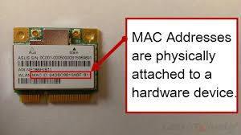

# Camada 2 - Enlace

A principal função da Camada de Enlace é fornecer um meio confiável para a transmissão de quadros (frames) entre dois dispositivos diretamente conectados na mesma rede (normalmente, na mesma LAN). Esta camada detecta e, opcionalmente, corrige erros que possam acontecer na camada física. É responsável pela transmissão e recepção (delimitação) de quadros e pelo controle de fluxo. Ela também estabelece um protocolo de comunicação entre sistemas diretamente conectados

---
## 1. Introdução
Essa camada se concentra na transferência de dados de forma confiável, detectando e corrigindo erros que possam ocorrer durante a transmissão, e gerencia o acesso ao meio físico. 

Ela trata de:

- Endereçamento físico (MAC Address)

- Delimitação e estruturação de quadros

- Detecção e controle de erros de transmissão

- Controle de acesso ao meio de transmissão (MAC – Medium Access Control)

- Gerenciamento do fluxo de dados

Em outras palavras, ela organiza os bits da camada física em estruturas significativas (quadros), controla quem pode usar o meio de transmissão e aplica mecanismos para garantir que os dados cheguem com integridade. Ao receber um pacote a camada de enlace precisa adicionar informação a esse pacote

Essa informação pode ser:

- Umcabeçalho e/ou trailer
- Cabeçalho adicionado ao início do pacote
- Trailer adicionado ao fim do pacote

---
## 2. Subcamadas da Camada 2

A Camada de Enlace é dividida em duas subcamadas

<p style={{textAlign: 'center'}}>Enlace  </p>

<div style={{textAlign: 'center'}}>
    
</div>
<p></p>

### 2.1 LLC (Logical Link Control)

O LLC atua como uma interface entre a camada de rede (camada 3 do modelo OSI) e a camada de enlace de dados (camada 2 do modelo OSI), facilitando a comunicação entre as redes. Ele fica responsável pela identificação de protocolos da camada superior(camada de rede) (ex: IPv4, IPv6, ARP).

- Define como os dados da camada de rede são encapsulados em quadros.

- Controla a comunicação lógica entre os dispositivos.

- Usa mecanismos opcionais de controle de fluxo e erro (raramente usados em redes Ethernet modernas).


### 2.2 MAC (Medium Access Control)

É UM conjunto de protocolos e regras que controlam como os dispositivos podem acessar e compartilhar a capacidade de transmissão em uma rede. A camada MAC garante que as transmissões de dados sejam eficientes e sem colisões, especialmente em redes compartilhadas como Ethernet. 

- Define como um dispositivo pode acessar e usar o meio físico.

- Controla o envio e recebimento de quadros dentro de um domínio de colisão.

Responsável também pelo envio de quadros, verificação de integridade com CRC, controle de transmissão em redes compartilhadas (ex: CSMA/CD no Ethernet tradicional).

---
## 3. Endereçamento MAC
MAC (Media Access Control) Address É um identificador físico e único atribuído a cada interface de rede (NIC) de um dispositivo.Funciona como uma placa de matrícula digital para cada dispositivo, permitindo que os switches e roteadores encaminhem corretamente os pacotes de dados para o destinatário correto. 

<p style={{textAlign: 'center'}}>MAC adress  </p>

<div style={{textAlign: 'center'}}>
    
</div>
<p></p>

Os endereços MAC são geralmente fixos e não podem ser alterados, a menos que o dispositivo seja substituído ou a placa de rede seja alterada. 

Representado em hexadecimal: `00:1A:2B:3C:4D:5E`

- Os três primeiros octetos identificam o fabricante (OUI – Organizationally Unique Identifier).

- Os três últimos identificam unicamente o dispositivo.

**Funções do MAC Address:**

- Identificar o destinatário de um quadro dentro de uma LAN.

- Permitir a filtragem e controle de acesso em switches e controladores de rede.

### 3.1 Switches e o MAC adress

Os switches operam na Camada 2 encaminhando quadros com base nos MAC Addresses. Então ele: 

- Mantém uma tabela MAC para associar endereços físicos a portas.

- Encaminha tráfego unicast de forma seletiva.

- Cria domínios de colisão individuais por porta.

- Pode implementar funcionalidades de segurança (ACLs, autenticação, espelhamento).

### 3.2 ARP — Address Resolution Protocol

A comunicação entre duas máquinas dentro da mesma rede precisa do endereço MAC de destino. Porém, as aplicações usam IPs (camada 3). O ARP faz essa conversão então, vamos supor que: 

- Dispositivo A quer enviar dados para o IP 192.168.1.10.

- Ele verifica se já tem o MAC correspondente em sua tabela ARP.

- Se não tiver, envia um ARP Request (broadcast): "Quem tem o IP 192.168.1.10?"

- O dispositivo dono desse IP responde com seu MAC.

- A entrada é armazenada na ARP Table (cache).

### 3.2 Exemplo prático
Coloque no seu terminal 

```
arp -a
```
Ele exibe a tabela ARP atual. Mostra os endereços IP e seus respectivos endereços MAC, além de outras informações como o tipo de endereço (Ethernet, por exemplo) e em qual tabela o endereço está armazenado, então algo do tipo:

```
192.168.1.10    00-1a-2b-3c-4d-5e   dynamic
```
---
## 4. Estrutura de um Quadro Ethernet (Frame)

Um quadro Ethernet (frame) é a unidade básica de dados transmitida em redes Ethernet, com uma estrutura específica para garantir a transmissão e a identificação dos dados.Ela serve para encapsular os dados e informações necessárias para a transmissão e entrega de informações em redes Ethernet. A estrutura inclui um preâmbulo para sincronização, endereços MAC de origem e destino, um campo de tipo/comprimento, dados e um CRC para detecção de erros. 

- **Preâmbulo (7 bytes):** Uma sequência de bits (101010...) usada para sincronizar o receptor com a transmissão.
- **SFD (Start Frame Delimiter) (1 byte):** Indica o início do quadro após o preâmbulo.
- **Endereço MAC de destino (6 bytes):** O endereço MAC do dispositivo que receberá o quadro.
- **Endereço MAC de origem (6 bytes):** O endereço MAC do dispositivo que enviou o quadro.
- **Tipo/Comprimento (2 bytes):** Indica o tipo de protocolo que está sendo usado nos dados (por exemplo, IPv4, ARP, etc.) ou o tamanho dos dados.
- **Dados (46-1500 bytes):** Os dados que estão sendo transmitidos (carga útil).
- **FCS (Frame Check Sequence) (4 bytes):** Um código de verificação usado para detectar erros durante a transmissão (CRC). 

| Campo                       | Tamanho       | Função                                                   |
| --------------------------- | ------------- | -------------------------------------------------------- |
| Preambulo                   | 7 bytes       | Sincronização de clock                                   |
| SFD (Start Frame Delimiter) | 1 byte        | Indica o início do quadro                                |
| MAC de Destino              | 6 bytes       | Endereço físico do receptor                              |
| MAC de Origem               | 6 bytes       | Endereço físico do remetente                             |
| Tipo / Tamanho              | 2 bytes       | Tipo de protocolo da camada superior (ex: 0x0800 = IPv4) |
| Dados (Payload)             | 46–1500 bytes | Informação útil                                          |
| CRC (Frame Check Sequence)  | 4 bytes       | Verificação de integridade do quadro                     |

---
## 5. Protocolos da Camada 2

### Ethernet (IEEE 802.3)
- Protocolo dominante nas redes cabeadas modernas.

- Define frame, regras de acesso ao meio (CSMA/CD), velocidades (10 Mbps até 100 Gbps+).

### Wi-Fi (IEEE 802.11)
- Protocolo dominante em redes locais sem fio.

- Implementa controle de acesso ao meio via CSMA/CA (Collision Avoidance).

- Possui mecanismos de autenticação, criptografia (WPA2, WPA3), roaming e gerenciamento de rádio.

### PPP (Point-to-Point Protocol)
- Usado em enlaces ponto-a-ponto, como conexões entre roteadores ou links WAN.

### HDLC (High-Level Data Link Control)
- Protocolo da Camada 2 usado em links seriais, especialmente em infraestruturas de operadoras.

### Frame Relay e ATM
- Protocolos legados usados em WANs. ATM (Asynchronous Transfer Mode) ainda encontra aplicação em alguns sistemas críticos.

---
## 6. Segurança na Camada 2

A Camada de Enlace, tal qual a física,  é frequentemente ignorada em implementações de segurança, mas ela é um dos **alvos mais fáceis e críticos para ataques em redes locais**.

### Principais ameaça

**MAC Spoofing**
Um atacante altera o MAC Address de sua placa para se passar por outro dispositivo.

**MAC Flooding**
Envio massivo de quadros com endereços MAC falsos, fazendo com que o switch "transborde" sua tabela CAM (Content Addressable Memory) e entre em modo de broadcast. Isso permite interceptação de tráfego.

**ARP Spoofing (ou ARP Poisoning)**
O ARP (Address Resolution Protocol) permite que dispositivos descubram o MAC de um IP. Um atacante pode enviar respostas ARP falsas e redirecionar o tráfego para si.

**DHCP Spoofing**
Um atacante pode simular um servidor DHCP e distribuir endereços IP falsos, redirecionando o tráfego para gateways maliciosos.

### Mecanismos de Defesa
**Port Security:** restringe os MACs permitidos em cada porta do switch.

**Dynamic ARP Inspection (DAI):** bloqueia pacotes ARP não confiáveis.

**DHCP Snooping:** permite apenas servidores DHCP autorizados.

**VLANs:** segmentam a rede logicamente, isolando domínios de broadcast.

**802.1X:** autenticação de dispositivos na porta antes do acesso à rede.
