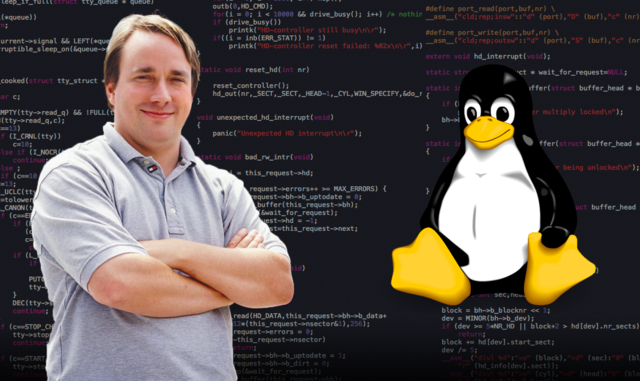
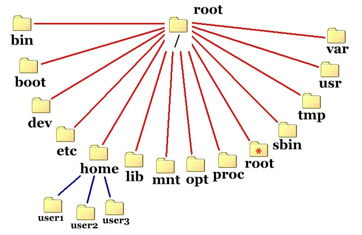
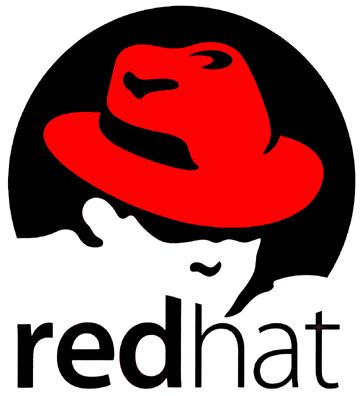
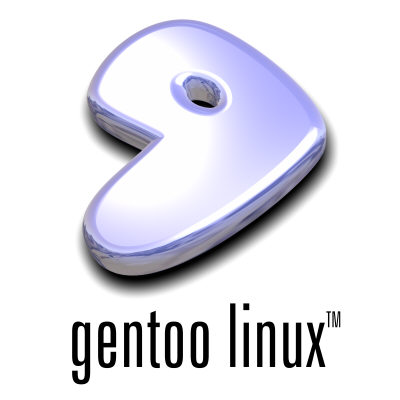

import Admonition from '@theme/Admonition';

# Linux

&emsp; Quando se fala em sistemas operacionais no contexto de segurança da informação, poucos nomes surgem com tanta força quanto o Linux. Embora a maioria dos usuários comuns esteja habituada ao Windows, profissionais de tecnologia , especialmente os que atuam em áreas como infraestrutura, cibersegurança, computação em nuvem e desenvolvimento, precisam dominar Linux em um nível técnico e prático.

## 1. Introdução

&emsp;O Linux, tecnicamente falando, é o **kernel , ou seja, o núcleo do sistema operacional**. O kernel é a parte mais fundamental de qualquer sistema operacional: é ele que gerencia a comunicação entre o software e o hardware. No caso do Linux, estamos falando de um kernel monolítico e modular, construído com o objetivo de ser seguro, eficiente e altamente configurável.

&emsp;Porém, no uso cotidiano, chamamos de “Linux” o conjunto completo de software que roda sobre esse kernel — o que inclui shells, bibliotecas, sistemas de arquivos, utilitários básicos e, em muitos casos, ambientes gráficos. Esse conjunto é o que forma uma distribuição Linux, como Ubuntu, Debian, Fedora ou Kali. Cada distribuição combina o kernel Linux com diferentes ferramentas, pacotes e configurações, moldando-o para propósitos específicos: desktop, servidores, dispositivos embarcados ou segurança ofensiva.

&emsp;O projeto Linux teve início em 1991, quando Linus Torvalds, então estudante de ciência da computação, anunciou que estava desenvolvendo um kernel de código aberto inspirado no Unix. A ideia inicial era apenas um projeto pessoal. No entanto, com o apoio da comunidade global de desenvolvedores e da filosofia do software livre, o Linux se expandiu rapidamente, tornando-se hoje um dos sistemas operacionais mais utilizados no mundo.

<p style={{textAlign: 'center'}}> Linus Torvalds </p>

<div style={{textAlign: 'center'}}>
    
</div>
<p></p>
<Admonition type="tips" title="OPCIONAL"> 

Se quiser saber um pouco sobre a história, recomendo esse documentário:

<iframe width="100%" height="500" src="https://www.youtube.com/embed/Z3f-M43DiD4?si=9O-2y7Vw-48OlBpN" title="YouTube video player" frameborder="0" allow="accelerometer; autoplay; clipboard-write; encrypted-media; gyroscope; picture-in-picture; web-share" referrerpolicy="strict-origin-when-cross-origin" allowfullscreen></iframe>
</Admonition>

## 2. Estrutura

&emsp;Assim como o Windows, o Linux possui uma estrutura em camadas — mas com princípios bem diferentes, como simplicidade, modularidade e transparência.

### 2.1 Kernel
&emsp;No centro de tudo está o kernel, que é carregado na inicialização e permanece em execução contínua, controlando os recursos de hardware: memória, processador, disco, placas de rede, etc. O kernel oferece APIs que os programas em espaço de usuário utilizam para solicitar serviços. Assim, comandos, scripts, serviços e aplicações não interagem diretamente com o hardware, mas sim através das chamadas de sistema oferecidas pelo kernel.

&emsp;O kernel Linux é monolítico e modular. Ele gerencia a CPU, memória, dispositivos, arquivos e segurança. Ele roda em espaço privilegiado (Ring 0), assim como o kernel do Windows.

### 2.2 Espaço de Usuário (User Space)
&emsp;Aqui é onde os programas de usuário rodam, incluindo shells (como bash, zsh), editores, navegadores, utilitários de rede, etc.

### 2.3 Shell

&emsp;O shell é a interface de linha de comando. É onde você digita comandos como ls, cat, cd, grep, sudo...

Por exemplo se você estiver no windows e apertar ```ctrl + r```, digitar ```cmd``` e depois apertar ```Enter``` vai abrir seu shell, powershell


O terminal não é opcional em Linux, especialmente para quem trabalha com segurança. Existem alguns tipos de Shell, os mais famosos para linux são o Bash ou Zsh

<Admonition type="caution" title="Bash x Zsh x Fish"> 

Bash, Zsh e Fish são diferentes shell interpreters que permitem a interação com o sistema operacional via linha de comando. O Bash é o shell padrão em muitos sistemas Linux e MacOS, sendo conhecido pela sua simplicidade e ampla compatibilidade.

 O Zsh oferece um ambiente mais personalizável, com recursos avançados como autocompletar e plugins, enquanto o Fish se destaca pela sua interface amigável e fácil de usar, com recursos embutidos como sugestões de comandos e navegação intuitiva. Mas no final, acredito que é questão de gosto, tanto é que uso Zsh. 

<iframe width="760" height="415" src="https://www.youtube.com/embed/vE0McEujAGk?si=vZllItDpf26yQdCH" title="YouTube video player" frameborder="0" allow="accelerometer; autoplay; clipboard-write; encrypted-media; gyroscope; picture-in-picture; web-share" referrerpolicy="strict-origin-when-cross-origin" allowfullscreen></iframe>

**Bash (Bourne Again Shell):**

- É o shell mais comum em sistemas Linux e MacOS. 

- Simplicidade: É conhecido pela sua simplicidade e estabilidade, sendo ideal para scripts e tarefas de nível de sistema. 

- Compatibilidade: É um shell amplamente compatível e fácil de usar para iniciantes. 

---
**Zsh (Z Shell):**
- Permite uma grande personalização com plugins e temas, oferecendo uma experiência mais interativa. 

-Oferece recursos como autocompletar, sugestões de comandos e histórico de comandos. 

- É compatível com scripts Bash, o que facilita a migração para quem já utiliza o Bash. 

---
**Fish (Friendly Interactive Shell):**

- Destaca-se pela sua interface amigável e fácil de usar, com recursos embutidos que facilitam a navegação.

- Possui recursos como sugestões de comandos, navegação intuitiva e autocompletar.

- É mais fácil de configurar e usar do que o Zsh, com recursos embutidos que dispensam a necessidade de plugins e extensões. 

</Admonition>

### 2.4 Sistema de Arquivos
&emsp; No Linux, tudo é representado como um arquivo: dispositivos, diretórios, sockets, pipes e até processos. Os utilizadores com experiência em Windows podem estranhar a ausência do C: ou D:, ou outras drives começadas por letras. No Linux, o sistema de ficheiros tem uma hierarquia, na qual, a partir da raiz existe um conjunto de diretórios. Cada diretório tem uma designação e funções específicas que a muito curto prazo farão sentido para o utilizador.


&emsp; Toda a estrutura dos ficheiros é hierárquica. O diretório raiz é representado uma barra para a frente, ou seja, “/”. Dentro do diretório raiz entram todos os restantes, designados por nomes compostos por três letras. Apesar de a designação de cada diretório parecer estranha a um utilizador iniciante, a muito curto prazo, estas designações serão lógicas e facilitarão que o utilizador se movimente pelo sistema, consoante a sua necessidade, por exemplo, para aceder e alterar configurações do sistema vai ao /etc/. Para verificar os logs de sistema vai a /var/logs/, etc.


<p style={{textAlign: 'center'}}> Diretórios </p>

<div style={{textAlign: 'center'}}>
    
</div>
<p></p>


**/ - Diretório Root**

O / é o root ou, em português, a raiz. Como o nome indica este é o diretório raiz do seu sistema Linux. É aqui que encontrará todos os restantes diretórios e todos os dados que se encontram em seu sistema. Até mesmo um CD/DVD, disco externo ou qualquer outro periférico se encontra dentro da raiz do sistema. Ao asceder à raiz, irá encontrar todos os restantes diretórios.

_Na linha de comandos você navega para o root digitando cd /._

---
**/bin/ - Binários essenciais**

O /bin/ é o diretório onde ficam guardados ficheiros binários que têm de estar acessíveis a todos os utilizadores do sistema. Estes ficheiros binários não são mais do que programas que o próprio sistema inicia de forma autónoma e independente do utilizador que utiliza o sistema. Outros programas que pertençam a um utilizador específico podem estar no diretório /usr/bin/. O diretório /sbin, quando exista, pode cumprir a mesma função do /bin.

_Da linha de comandos, o utilizador chega ao /bin digitando cd /bin/._

---
**/dev/ - Arquivos de dispositivos**

O /dev/ é o diretório onde ficam ficheiros especiais associados aos dispositivos do sistema. Estes ficheiros são especiais porque representam os dispositivos do sistema. Por exemplo, um disco rígido do sistema aparecerá como /dev/sda. Muitos dos ficheiros encontrados no /dev/ não são mais do que ficheiros virtuais que na realidade podem nem existir. Por exemplo, o /dev/null não é mais do que um pseudo ficheiro que não produz qualquer output e descarta automaticamente todo o input que recebe. Ou seja, converte qualquer input em nada ou null. Outro exemplo de pseudo ficheiro é o /dev/random que não faz mais do produzir um número aleatório. Repare que tanto o /dev/random, como o /dev/null se enquadram mais na categoria de dispositivos, pois executam uma tarefa específica. São portanto dispositivos virtuais.

_Na linha de comandos você navega para o /dev/ digitando cd /dev/._

---
**/etc/ - Ficheiros de configuração**

O /etc/ é o diretório onde se encontram todos os ficheiros globais de configuração do sistema. Na sua grande maioria estes ficheiros podem ser editados com recurso a um simples editor de texto. Repare que neste diretório encontra ficheiros de configuração do sistema e não de um utilizador específico. Os ficheiros de configuração de um utilizador específico encontram-se no ficheiro home de cada utilizador.

_O Usuário pode ver a totalidade dos ficheiros de configuração existentes no seu diretório /etc/ executando a seguinte instrução na linha de comandos: ls /etc/._

---
**/home/ - Arquivos de utilizadores**

O /home/ é o diretório onde encontramos um arquivo por cada utilizador existente no sistema.
Sempre que adicionamos um novo utilizador ao sistema, por exemplo com o nome utilizador2 no diretório /home/ é criado um arquivo para este utilizador, aparecendo como /home/utilizador2/. Neste caso, dentro do arquivo utilizador2 ficarão todos os ficheiros de configurações específicas para aquele utilizador, bem como todos os seus ficheiros de dados.

_Na linha de comandos para navegar para o arquivo /home/ basta digitar cd ~ ._

---
**/lib/ - Bibliotecas partilhadas e módulos Kernel**

O /lib/ é o diretório onde estão armazenadas as bibliotecas partilhadas no sistema. Estas bibliotecas podem variar consoante a Distribuição utilizada e podem ser, por exemplo Bibliotecas de linguagens como perl, python, C, entre outras. É também neste diretório que estão os módulos do Kernel do Sistema Operativo.

_Da linha de comandos, o utilizador chega ao /lib digitando cd /lib ._

---
**/mnt/ - Pontos de montagem temporários**

O /mnt/ é o diretório onde podemos encontrar pontos de montagem temporários, ou seja, é aqui que são criados os ficheiros especiais associados aos dispositivos do sistema temporários. Estes dispositivos podem diversos dispositivos como CD/DVD, USB, etc. Apesar de este ser o diretório padrão para a montagem de dispositivos temporários, é possível montá-los em outras localizações do sistema de ficheiros.

_Poderá deslocar-se para este diretório digitando cd /mnt ._

---
**/proc/ - Arquivos de processos**

O /proc/ é o arquivo onde se encontram ficheiros especiais associados aos processos do sistema. Estes ficheiros são especiais porque representam os processos em funcionamento no sistema. Por exemplo, haverá um ficheiro que fornece informação sobre o funcionamento do processador, ou sobre outras operações que ocorram no sistema.

_Na linha de comandos, basta digitar cd /proc para aceder a este diretório._

---
**/root/ - Diretório raiz do Super Utilizador Root**

O /root/ é o arquivo home do root, o Super Uilizador de sistema. Este diretório não é a mesma coisa que a raiz do sistema / , de onde descendem todos os restantes diretórios. Trata-se sim de um diretório dedicado ao utilizador root.

_Na linha de comandos, o utilizador chega ao /sbin digitando cd /root ._

---
**/sbin/ - Binários de sistema**

O /sbin/ é o diretório destinado aos ficheiros binários que são utilizados pelo Super Utilizador root e para administração do sistema. Pode-se dizer que este diretório é semelhante ao /bin/ , mas com a particularidade de serem programas que normalmente não serão utilizados por utilizadores com permissões limitadas. Este diretório pode não existir num sistema e pode também substituir o diretório /bin/ .

_Da linha de comandos, o utilizador chega ao /sbin digitando cd /sbin ._


---
**/tmp/ - Ficheiros temporários**

O /tmp/ é o diretório onde encontramos os ficheiros temporários do sistema. Estes ficheiros são normalmente gerados pelo sistema e como o nome indica, permanecem no sistema durante um período limitado de tempo. Por exemplo, sempre que instalamos um programa, este utiliza o diretório /tmp/ para colocar ficheiros que serão necessários durante a instalação, mas que não voltarão a ser necessários.

_Da linha de comandos, podemos chegar ao /tmp digitando cd /tmp ._

---
**/usr/ - Programas e aplicações de utilizadores**

O /usr/ é o diretório onde estão ficheiros e programas utilizados pelos utilizadores existentes no sistema. No caso dos programas, no diretório /usr/bin ficam todas as aplicações que não são essenciais ao sistema e, por conseguinte, não se encontram no diretório /sbin/ ou /bin/ . No caso dos programas que ficam no diretório /usr/bin/ as bibliotecas associadas a estes sistemas ficam localizadas no diretório /usr/lib/ .

_Para acessar a este diretório da linha de comandos, basta digitar cd /usr/ ._

---
**/var/ - Ficheiros e dados variáveis**

O /var/ é o diretório onde ficam diversos ficheiros de dados vindos das contas de utilizadores. Este pode ser visto como um diretório “eco” do que acontece no diretório /usr/, pois estes últimos têm permissões de read only, pelo que os registos de tudo o que acontece, ou seja, os logs são escritos no /var/. É também neste diretório que são colocadas bases de dados locais pertencentes a programas instalados pelos utilizadores.

_Para aceder a este diretório da linha de comandos, basta digitar cd /var/ ._

---
**/boot/ - Ficheiros de arranque do sistema**

O /boot/ é o diretório onde se encontram variados ficheiros necessários ao arranque do sistema operativo. É neste diretório, por exemplo, que podemos encontrar os ficheiros Boot Loaders, responsáveis por gerir o arranque do sistema. Regra geral, não é aconselhável alterar o conteúdo deste diretório e as próprias configurações dos Boot Loaders não se encontram neste diretório mas sim no /etc/ .
_Para acessar a este diretório da linha de comandos, basta digitar cd /boot/ ._

---
**/lost+found/ - Perdidos e achados do sistema**

O /lost+found/ é o diretório que serve precisamente para o que o seu nome indica. Perdidos e Achados. Se, por alguma razão, o seu sistema sofrer um crash e for encerrado inesperadamente, da primeira vez que iniciar o sistema após este evento, ele iniciar será averiguar o sistema e todos os ficheiros ou fragmentos encontrados serão colocados no /lost+found/. Este procedimento permite que os utilizadores consigam recuperar o máximo de informação possível após uma falha de sistema.

_Este diretório pode ser acedido da linha de comandos, digitando cd /lost+found/ ._

---
**/run/ - Arquivos de aplicações**

O /run/ é um diretório considerado recente, uma vez que não existe desde sempre como outros referidos. Neste diretório ficam ficheiros com informações necessárias para que um determinado programa ou processo possa ser executado. Digamos que é uma área de trabalho que os programas do sistema podem usar.

_Acesse este diretório pela linha de comandos, digitando cd /run/ ._

---
**/selinux/ - Segurança reforçada no Linux**(Não tem em todos os sistemas)

O /selinux/ é outro diretório que seguramente não encontrará em muitas distribuições, uma vez que este sistema apenas está incluído em algumas distribuições. Selinux significa Security Enhanced Linux. Trata-se de um módulo de segurança com diversas funcionalidades que permitem segurar um sistema Linux. Quando este módulo se encontra num sistema o diretório /selinux/ pode ser criado, incluindo ficheiros associados ao funcionamento deste módulo, mas também um sistema de ficheiros virtual.

_Acesse a este diretório pela linha de comandos, digitando cd /selinux/ ._

## 3. Permissões

A segurança do Linux é baseada, desde sua origem, em princípios como separação de privilégios, permissões mínimas e isolamento de processos. Esses conceitos, fundamentais para segurança da informação, são aplicados de forma consistente em todo o sistema.

Todo arquivo, diretório ou recurso possui um conjunto de permissões que determinam quem pode ler, escrever ou executar aquele recurso. Essas permissões são associadas a três tipos de entidades: o dono do arquivo, o grupo ao qual ele pertence e os outros usuários. O controle de acesso é simples, porém poderoso, e pode ser manipulado via comandos como chmod, chown, umask e setfacl.

Além das permissões básicas, sistemas Linux corporativos ou sensíveis frequentemente utilizam mecanismos de controle de acesso mandatório, como o SELinux (Security Enhanced Linux) ou o AppArmor, que aplicam políticas de segurança mais restritivas e baseadas em contexto. Essas soluções são fundamentais para proteção contra vulnerabilidades de dia zero, escalonamento de privilégios e execução não autorizada de processos.

Além disso, o Linux permite a implementação de firewalls e filtros de pacotes diretamente no sistema, com ferramentas como iptables e nftables. Esses mecanismos, embora exigentes no início, oferecem controle total sobre o tráfego de rede, algo essencial em qualquer ambiente seguro.

Exemplo com CHMOD
```bash

chmod +x arquivo_script.sh

```

<p style={{textAlign: 'center'}}> Permissões </p>

<div style={{textAlign: 'center'}}>
    
</div>
<p></p>

_o chmod é o comando e a chamada de sistema que pode alterar permissões de acesso de objetos do sistema e sinalizações de modo especial._

## 4. Por que o Linux é central em segurança da informação?
A resposta está tanto na natureza técnica do sistema quanto na realidade do mercado.

Tecnicamente, o Linux oferece uma combinação de:

- Transparência total do código-fonte(Open Source);

- Controle fino sobre permissões, processos e rede;

- Suporte para ferramentas de segurança modernas;

- Facilidade de automação com shell scripts;

- Ferramentas nativas de auditoria e monitoramento.

---
Na prática, o Linux é amplamente utilizado em:

- Servidores Web (Apache, Nginx);

- Sistemas em nuvem (Amazon EC2, Google Cloud, Azure);

- Roteadores, firewalls, switches;

- Plataformas de containers e orquestração (Docker, Kubernetes);

- Ferramentas de segurança ofensiva (Kali Linux, Metasploit,...);

- Análise forense e resposta a incidentes.

Se você pretende trabalhar com pentest, análise de vulnerabilidades, defesa de infraestrutura, forense digital ou segurança em nuvem, **saber Linux é um pré-requisito técnico e prático.**

## 5. O que são distribuições linux?

Ao contrário de sistemas operacionais como o Windows ou macOS, que são mantidos e distribuídos por uma única empresa em uma versão única, o Linux segue um modelo completamente diferente. Ele é construído em torno de um componente central — o kernel Linux — e a partir dele são desenvolvidos sistemas operacionais completos, chamados de distribuições ou, mais comumente, distros.

```O que exatamente é uma distribuição Linux?```

Uma distribuição Linux é um sistema operacional completo, baseado no kernel Linux, combinado com um conjunto de softwares que o tornam utilizável no dia a dia. Isso inclui:

- Shells e utilitários básicos (como bash, grep, ls, chmod, systemctl);

- Gerenciadores de pacotes (como APT, DNF, pacman);

- Serviços de inicialização (como systemd ou OpenRC);

- Ambientes gráficos (como GNOME, KDE ou XFCE);

- Ferramentas administrativas, bibliotecas e drivers;

- Documentação e scripts de instalação/configuração.

Ou seja, o Linux “puro” (o kernel) é apenas a base. Cada distribuição escolhe como empacotar, configurar e distribuir esse kernel e os softwares complementares, criando sistemas com características e propósitos específicos. Por isso existem distribuições voltadas para servidores, desktop, roteadores, dispositivos embarcados, ambientes educacionais, segurança ofensiva e por aí vai.

```Por que existem tantas distribuições?```

A flexibilidade do modelo open source permite que qualquer organização, empresa ou comunidade crie sua própria distribuição, com foco em determinada finalidade ou filosofia.

Algumas distribuições são generalistas e voltadas para o público em geral, enquanto outras são altamente especializadas. Essa diversidade pode parecer confusa no início, mas é uma das maiores vantagens do ecossistema Linux: você pode escolher (ou criar) exatamente o sistema que atende às suas necessidades.

## 6. Distribuições linux mais comuns e qual usar?(Recomendaçaões minhas)

Ao escolher uma distribuição Linux, o ideal é considerar três pontos: o nível de conhecimento prévio, o objetivo de aprendizado (uso geral, segurança, servidores, etc.) e o nível de complexidade que você está disposto a enfrentar.

Abaixo, organizei as distribuições mais conhecidas e relevantes para quem quer estudar, da mais simples até a mais complexa(Obvio que ainda existem inúmeras outras, mas listei as que achei que seriam mais interessantes).

---
### Linux Mint

**Nível:** Iniciante 

**Base:** Ubuntu/Debian

**Vantagens:**

- Interface semelhante ao Windows, ideal para quem está migrando.
- Fácil de instalar, configurar e usar.
- Excelente para uso diário enquanto aprende Linux.
- Vem com codecs, drivers e programas básicos.

**Desvantagens:**

- Não é ideal para uso profissional em servidores.
- Pouco usada em ambientes de segurança, então o aprendizado pode ser limitado à parte visual do sistema.

<p style={{textAlign: 'center'}}>Linux Mint</p>

<div style={{textAlign: 'center'}}>
    
</div>
<p></p>

Ótima porta de entrada para quem quer começar sem susto e tem medo de Terminal.

---
### Ubuntu (Desktop e Server)

**Nível:** Iniciante a intermediário

**Base:** Debian

**Vantagens:**

- Grande comunidade e farta documentação.
- Muito usado em servidores, cloud e desenvolvimento.
- Suporte da Canonical, inclusive versões LTS com 5 anos de suporte.
- Permite aprendizado real da estrutura do Linux.

**Desvantagens:**

- Algumas customizações gráficas podem esconder o funcionamento interno.
- O uso de Snap packages pode confundir o gerenciamento de software.

<p style={{textAlign: 'center'}}>Ubuntu</p>

<div style={{textAlign: 'center'}}>
    
</div>
<p></p>

Recomendado como primeira distro séria para aprender Linux e administração de sistemas.

---
### Manjaro

**Nível:** Intermediário

**Base:** Arch Linux

**Vantagens:**

- Interface moderna e bem polida.
- Base Arch com gerenciamento simplificado.
- AUR (repositório do Arch) disponível com milhares de pacotes.

**Desvantagens:**

- Pode quebrar com atualizações mal feitas.
- Apesar de amigável, exige mais atenção do que Ubuntu/Debian.

<p style={{textAlign: 'center'}}>Manjaro</p>

<div style={{textAlign: 'center'}}>
    
</div>
<p></p>

Para quem quer um sistema moderno, rolling release, e começar a conhecer a filosofia Arch sem mergulhar de vez.

---
### Debian

**Nível:** Intermediário a avançado

**Base:** Própria

**Vantagens:**

- Altíssima estabilidade.
- Base de várias distros (Ubuntu, Kali, etc.).
- Amplo uso em servidores e ambientes corporativos.

**Desvantagens:**

- Pacotes menos atualizados.
- Configuração inicial mais manual.

<p style={{textAlign: 'center'}}>Debian</p>

<div style={{textAlign: 'center'}}>
    
</div>
<p></p>

Excelente para aprender como o Linux realmente funciona, com estabilidade de servidor.

---
### Fedora

**Nível:** Intermediário a avançado

**Base:** Red Hat

**Vantagens:**

- Sempre com as tecnologias mais recentes.
- Ideal para aprender o ecossistema Red Hat.
- Base para o RHEL (Red Hat Enterprise Linux).

**Desvantagens:**

- Pode ser instável em releases mais novas.
- Ciclo de suporte mais curto (cerca de 13 meses).

<p style={{textAlign: 'center'}}>Fedora</p>

<div style={{textAlign: 'center'}}>
    
</div>
<p></p>

Bom para quem quer estar na vanguarda e aprender conceitos corporativos modernos.

---
### Kali Linux (Calma lá Mr. Robot)

**Nível:** Intermediário a avançado

**Base:** Debian

**Vantagens:**

- Vem com mais de 600 ferramentas de pentest e análise forense.
- Pronto para testes de invasão, CTFs, OSINT, engenharia reversa.
- Mantido pela Offensive Security.

**Desvantagens:**

- Não é uma distro para iniciantes. Supõe que você já domina terminal, permissões e rede.
- Fácil de usar superficialmente, difícil de entender profundamente.

<p style={{textAlign: 'center'}}>Kali Linux</p>

<div style={{textAlign: 'center'}}>
    
</div>
<p></p>

Recomendado para praticar segurança ofensiva após dominar os fundamentos do Linux.

---
### Tails

**Nível:** Intermediário a avançado

**Base:** Debian

**Vantagens:**

- Sistema operacional voltado para anonimato e privacidade.
- Roda inteiramente da RAM, sem deixar rastros.
- Vem com Tor, criptografia e ferramentas de segurança.

**Desvantagens:**

- Não é um sistema para uso geral.
- Muito limitado em personalização.
- Não persistente por padrão (a não ser com pendrive configurado).

<p style={{textAlign: 'center'}}>Tails</p>

<div style={{textAlign: 'center'}}>
    
</div>
<p></p>

Para aprender sobre segurança operacional (OPSEC) e navegação anônima.

---
### Red Hat Enterprise Linux (RHEL) / CentOS / AlmaLinux / Rocky Linux

**Nível:** Avançado / Corporativo

**Base:** Própria (Red Hat)

**Vantagens:**

- Padrão de mercado em empresas, bancos, instituições públicas.
- Sistema robusto, seguro e com suporte comercial.
- Aprendizado compatível com certificações como RHCSA/RHCE.

**Desvantagens:**

- Instalação e configuração exigem conhecimento.
- Ecossistema mais fechado (especialmente RHEL).
- CentOS tradicional foi descontinuado (agora CentOS Stream).

<p style={{textAlign: 'center'}}>RHEL / derivados</p>

<div style={{textAlign: 'center'}}>
    
</div>
<p></p>

Ideal para quem quer trabalhar com segurança em empresas que usam Linux em data centers e infraestrutura crítica.

---
### Arch Linux

**Nível:** Avançado

**Base:** Própria

**Vantagens:**

- Instalação minimalista e altamente personalizável.
- Filosofia “faça você mesmo”.
- Pacotes extremamente atualizados.
- Enorme aprendizado prático do sistema Linux “por dentro”.

**Desvantagens:**

- Curva de aprendizado íngreme.
- Qualquer erro na configuração pode impedir o sistema de funcionar.
- Demanda tempo e atenção constante.

<p style={{textAlign: 'center'}}>Arch Linux</p>

<div style={{textAlign: 'center'}}>
    
</div>
<p></p>

Para quem quer entender cada componente do sistema e construir tudo do zero.

---
### Gentoo

**Nível:** Avançado / Especialista

**Base:** Própria

**Vantagens:**

- Compilação de pacotes personalizada para sua máquina.
- Controle total sobre o sistema, inclusive otimizações de performance e segurança.
- Ideal para estudar kernel, bibliotecas e bootloader em profundidade.

**Desvantagens:**

- Processo de instalação e manutenção extremamente técnico e demorado.
- Pouco produtivo para uso geral ou testes rápidos.

<p style={{textAlign: 'center'}}>Gentoo</p>

<div style={{textAlign: 'center'}}>
    
</div>
<p></p>

Para aprendizado avançado de Linux, compilação, performance e tuning de sistemas críticos.

---
<Admonition type="caution" title="Importante!"> 

É muito comum, ao entrar no universo da segurança da informação, que os estudantes se sintam atraídos imediatamente por distribuições como o Kali Linux. Afinal, trata-se de um sistema com aparência profissional, repleto de ferramentas conhecidas e amplamente usado em ambientes de pentest, CTFs e certificações e convenhamos em Séries como Mr.Robot. O problema é que essa escolha, embora pareça lógica à primeira vista, não é a mais eficaz para quem está começando, muito pelo contrário.

Distribuições como **Kali, Parrot ou até mesmo Arch e Gentoo oferecem um ambiente extremamente personalizável**, mas pressupõem que o usuário já entenda profundamente o funcionamento do Linux. Isso inclui domínio de **terminal, permissões, estrutura de diretórios, gerenciamento de pacotes, redes, serviços, logs e muitos outros conceitos fundamentais.** Sem essa base, o que geralmente acontece é que a pessoa fica limitada a executar ferramentas sem entender o que está fazendo. Você até pode usar, mas convenhamos, não sabe usar direito e provavelmente está despediçando memória ou seu tempo.

A analogia que gosto de usar é a seguinte: o Kali Linux é uma mala de ferramentas. Imagine dar uma maleta de instrumentos cirúrgicos para alguém que nunca estudou medicina. Essa pessoa pode até abrir a maleta, ligar alguns aparelhos, mas dificilmente vai entender o propósito real de cada item, muito menos usá-los com precisão. Com o Kali, acontece a mesma coisa. **Ter as ferramentas não é o mesmo que saber usar, e saber usar não é o mesmo que entender como e por que elas funcionam.**

Portanto, não recomendo que iniciantes comecem pelo Kali Linux ou outras distribuições voltadas diretamente para segurança ofensiva. Isso não significa que Kali seja ruim (pelo contrário, é uma ferramenta ótima). Mas como qualquer ferramenta, ela deve ser usada no momento certo.

Minha recomendação é começar com uma distribuição mais estável, previsível e amigável à aprendizagem, como o **Debian, o Ubuntu, Manjaro ou o Fedora.** Essas distribuições permitem que você aprenda de forma progressiva como o Linux funciona: desde o particionamento de disco, permissões, execução de serviços, gerenciamento de pacotes, até scripts e segurança básica. São sistemas usados amplamente em produção, em empresas, servidores e cloud , ou seja, além de fornecerem uma base sólida, também refletem o ambiente real que você encontrará no mercado.

Só depois de compreender bem o sistema é que faz sentido migrar para distribuições mais especializadas, como o Kali Linux, Parrot OS ou mesmo ambientes minimalistas como Arch e Gentoo. Nesse estágio, você já não estará simplesmente “executando ferramentas”, mas sim controlando o ambiente em que elas operam. E isso faz toda a diferença.

Você não precisa do Kali para ser um profissional de segurança. Qualquer distribuição pode ser adaptada com as ferramentas certas. Kali é apenas uma conveniência.

**Se você busca se tornar um profissional sólido em segurança da informação, construa a base primeiro.**

</Admonition>
---

## 7. Como rodar o Linux? Métodos para instalar, testar ou usar sem apagar o Windows
Aprender Linux não exige necessariamente apagar o Windows do computador. Existem várias formas de experimentar e usar distribuições Linux de forma segura, prática e reversível.

### Live USB (sem instalação)
Você pode gravar a imagem ISO de uma distro (como Ubuntu, fedora ou Tails) em um pen drive usando ferramentas como Rufus (no Windows) ou Balena Etcher (multi-plataforma).
Ao iniciar o computador por esse pen drive, o Linux será executado diretamente da memória RAM, sem alterar o sistema instalado, ou seja, quando você remover o pendrive e reinicar o computador você vai ter o seu SO antigo de volta.

Ideal para testes rápidos ou uso ocasional com segurança (como no caso do Tails).

<iframe width="560" height="315" src="https://www.youtube.com/embed/gXorVu1_B2A?si=i_8XPxDCS9tJi-t6" title="YouTube video player" frameborder="0" allow="accelerometer; autoplay; clipboard-write; encrypted-media; gyroscope; picture-in-picture; web-share" referrerpolicy="strict-origin-when-cross-origin" allowfullscreen></iframe>

_OBS: No PC do inteli é provável que você tenha que entrar na BIOS e colocar o pendrive como primeira opção manualmente._

---
### Instalação em dual boot
Nesse modelo, você instala o Linux ao lado do Windows no mesmo disco ou em discos separados.
Na inicialização, o GRUB (bootloader do Linux) permite escolher qual sistema iniciar.

**Vantagens:**

- Mantém o Windows intacto.

- Permite uso completo do Linux com performance nativa.

**Desvantagens:**

- Requer cuidado ao particionar o disco (risco de apagar dados).

- Pode exigir ajustes em UEFI/BIOS.


<iframe width="560" height="315" src="https://www.youtube.com/embed/6D6L9Wml1oY?si=K3tCweXbIJ-EQrn7" title="YouTube video player" frameborder="0" allow="accelerometer; autoplay; clipboard-write; encrypted-media; gyroscope; picture-in-picture; web-share" referrerpolicy="strict-origin-when-cross-origin" allowfullscreen></iframe>

---
### Instalação em segundo SSD ou HD
Se você tiver dois discos físicos no computador, pode instalar o Linux em um disco dedicado.
Isso simplifica o gerenciamento dos sistemas e isola fisicamente os ambientes.

É a melhor opção se você quer evitar qualquer risco ao sistema principal, especialmente em notebooks com suporte a dois SSDs.

<iframe width="560" height="315" src="https://www.youtube.com/embed/qmykhEs3akw?si=BG-CzzoFW1P7BgZy" title="YouTube video player" frameborder="0" allow="accelerometer; autoplay; clipboard-write; encrypted-media; gyroscope; picture-in-picture; web-share" referrerpolicy="strict-origin-when-cross-origin" allowfullscreen></iframe>

---
### Máquinas virtuais (VirtualBox, VMware)
Com softwares como VirtualBox ou VMware Workstation, é possível criar uma máquina virtual e rodar Linux dentro do Windows.

**Ideal para:**

- Estudo de comandos, scripts, permissões.

- Teste de ferramentas e ambientes de rede simulada.

- Uso paralelo com ferramentas do Windows.

**Desvantagem:**

- Performance reduzida.

- Acesso limitado a dispositivos físicos e aceleração gráfica.

<iframe width="560" height="315" src="https://www.youtube.com/embed/eKAkOxSi4Cs?si=rAo0jVUi0rZgEH1Q" title="YouTube video player" frameborder="0" allow="accelerometer; autoplay; clipboard-write; encrypted-media; gyroscope; picture-in-picture; web-share" referrerpolicy="strict-origin-when-cross-origin" allowfullscreen></iframe>

---
## Aprofundamento
Agora que você tem uma noção um pouco melhor sobre o que é o Linux, nem tudo são flores e é claro que você vai ter que aprender na prática a usar esse SO, leia a última sessão e instale o SO que achar ser melhor, se você nunca mexeu em um recomendo usar **Ubuntu, Debian, Fedora ou Manjaro**. Caso não queira trocar sozinho o IT Bar troca para você para o Ubuntu se você pedir para eles também.


Enfim, vou deixar alguns links para vocês treinarem. Não adianta só estudar a teoria do sistema, tem que realmente entrar na prática, porque tudo que ensinei para vocês aqui é teoria, que no final só é útil se você pratica, então, deixei alguns mini cursos para vocês aprenderem comandos do básico ao intermediário, alguns sites para treinar na prática e um livro para usar de material complementar, ao invés e usar GPT recomendo que dê uma olhada nesse livro para dúvidas envolvendo comandos.

**Todo material abaixo é Gratuito!**

### Cursos

Cursos do HTB, tem bastante material escrito e exercícios para vocês aprofundarem o que ensinei acima e mais, inclusive deixei um mini curso de bashscript para vocês aprenderem a criar scripts em bash(Sim isso é possível). O HTB também tem alguns laboratórios práticos dentro dos cursos deeles

[Linux HTB 1](https://academy.hackthebox.com/module/details/18)

[Linux BashScript](https://academy.hackthebox.com/module/details/21)

[Linux HTB 2](https://academy.hackthebox.com/module/details/31)

[Linux HTB 3](https://academy.hackthebox.com/module/details/51)

---

Inclusive, se você já está com Ubuntu:
<iframe width="560" height="315" src="https://www.youtube.com/embed/epiyExCyb2s?si=mIb1Kx9vZpJDmlTb" title="YouTube video player" frameborder="0" allow="accelerometer; autoplay; clipboard-write; encrypted-media; gyroscope; picture-in-picture; web-share" referrerpolicy="strict-origin-when-cross-origin" allowfullscreen></iframe>

---

### Sites práticos

Esse site tem alguns módulos para você ir do básico até o intermediário treinando no próprio site deles e com um material leve:  https://linuxjourney.com/

Para aprofundar, recomendo que joguem esse jogo, é um jogo para aprender na prática muitos comandos linux e algumas informações extras, ele foi pensado para quem nunca mexeu, mas a partir de certo ponto ele vai ficando bem complexo. Dito isso, ótimo para aprender progressivamente: https://overthewire.org/wargames/

### Livro Didáticos

Esse livro é o material didádico para uma certificação internacional de Linux, ele é bem completo, então recomendo usar de material complementar e de aprofundamento.

Baixe o LPI Linux Essentials:  https://learning.lpi.org/pt/learning-materials/learning-materials/

