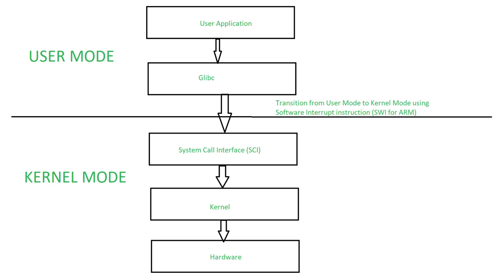

import Admonition from '@theme/Admonition';

## 1. Introdução

O Windows é, sem dúvida, o sistema operacional mais conhecido do mundo. Seja em computadores pessoais, estações de trabalho corporativas ou ambientes híbridos de servidores, ele está presente em diversos contextos.

Mas para quem trabalha com segurança da informação, é essencial olhar além da interface gráfica e entender como o Windows funciona por dentro — especialmente como ele evoluiu desde o MS-DOS, qual sua arquitetura, como gerencia processos, permissões e por que continua sendo um alvo recorrente de ciberataques.

---
## 2. História: Do MS-DOS ao Windows 11

O Windows é uma família de sistemas operacionais desenvolvida pela Microsoft, amplamente utilizada em ambientes corporativos, governamentais e domésticos. Por trás da sua interface amigável e gráfica, o Windows possui uma arquitetura complexa e poderosa, baseada no núcleo NT (New Technology).

Desde o Windows NT 3.1 (1993) até o Windows 11 e Windows Server 2022, o Windows evoluiu para oferecer suporte a multitarefa, multiusuário, controle de acesso, serviços de diretório (como o Active Directory) e segurança robusta, embora continue sendo alvo de ataques justamente por sua popularidade.

Evolução Windows  

    

Antes do Windows, a Microsoft criou o **MS-DOS (Microsoft Disk Operating System)** — um sistema operacional baseado em linha de comando, lançado em 1981 para o IBM PC. O DOS era monousuário, monotarefa e com acesso direto ao hardware, sem camadas de segurança como temos hoje.

Principais características do MS-DOS:
- Interface baseada apenas em texto (CLI).

- Sem multitarefa real.

- Acesso direto à memória e dispositivos (sem gerenciamento seguro).

- Executava arquivos .exe ou .com diretamente.

O Windows 1.0 surgiu em 1985 como uma camada gráfica por cima do MS-DOS. Mas só a partir do Windows NT (1993) é que a Microsoft lançou um sistema verdadeiramente moderno, com arquitetura baseada em kernel, modelo cliente/servidor, multitarefa preemptiva e segurança integrada.

Hoje, o Windows 10/11 e o Windows Server **são descendentes diretos dessa linha NT e não mais do MS-DOS.**

---
## 3. Arquitetura do Windows
A arquitetura do Windows é modular e híbrida, combinando características de kernel monolítico com microkernel. Ela é dividida em dois grandes domínios:

### Modo Usuário (User Mode)
É onde rodam os aplicativos, utilitários do sistema e algumas bibliotecas. O modo usuário não tem acesso direto ao hardware, o que garante uma camada de segurança e estabilidade.

Componentes:

**Aplicações:** navegadores, editores, antivírus, etc.

**Ambientes de execução:** Win32, .NET CLR, UWP.

**Subsistemas de ambiente:** subsistemas POSIX (legado), WoW64 (para rodar apps 32-bit em SO 64-bit).

**Serviços do Windows:** processos rodando em background que executam funções do sistema (ex: Windows Update, DHCP Client, etc.)

---
### Modo Kernel (Kernel Mode)
Executado com privilégios elevados, este modo gerencia a comunicação com o hardware e fornece os principais serviços de sistema.

Componentes:

**NT Kernel (ntoskrnl.exe):** núcleo do sistema.

**HAL (Hardware Abstraction Layer):** camada que abstrai as diferenças de hardware.

**Gerenciadores de subsistemas:** memória, arquivos, I/O, segurança.

**Drivers de dispositivos:** responsáveis por interagir com o hardware físico.

**Executive Services:** APIs internas usadas pelo modo usuário para acessar o kernel.

Para um atacante, conseguir executar código no modo kernel significa controle total do sistema.

Arquitetura  

    

---
## 4. Componentes Fundamentais

**Gerenciador de Processos:**
  Responsável por criar, agendar e finalizar processos. Pode ser observado usando o Gerenciador de Tarefas, tasklist, taskkill ou Process Explorer.

**Gerenciador de Memória:**
  O Windows usa um modelo de memória virtual com paginação. Cada processo tem seu próprio espaço de memória isolado, o que aumenta a segurança.

**NTFS (New Technology File System):**
  Sistema de arquivos padrão do Windows moderno. Suporta:

- Controle de acesso (ACLs)

- Compressão

- Criptografia (EFS)

- Journaling

**Active Directory (AD)**
Um dos componentes mais importantes em ambientes corporativos. Permite gerenciar identidades, autenticação e políticas de segurança centralizadas em redes com domínio Windows.

---
## 5. Segurança no Windows
A Microsoft investiu bastante em segurança nos últimos anos, mas o Windows ainda **é o sistema mais atacado do mundo** justamente por ser o mais popular.

Principais mecanismos de segurança:
- **UAC (User Account Control):** impede que aplicações executem ações administrativas sem autorização.

- **BitLocker:** criptografia de disco.

- **Windows Defender / Security Center**

- **SmartScreen:** bloqueio de apps desconhecidos.

Patch Management com Windows Update.

- **Modelo de permissões:**
Baseado em SID (Security Identifier) e ACLs (Access Control Lists). Todo objeto (arquivo, chave de registro, processo) possui uma lista de controle de acesso detalhada.

- **Registro do Windows (Windows Registry)**
Uma base de dados onde o sistema e as aplicações armazenam configurações. Muito explorado em ataques para persistência ou manipulação do comportamento do sistema.

---
## 6. Por Que o Profissional de Segurança Deve Conhecer o Windows?
**Porque a maioria dos alvos ainda é Windows.**
Sistemas bancários, redes corporativas, universidades, órgãos públicos... todos usam Windows em larga escala.

**Porque você precisa aplicar hardening.**
Desativar serviços desnecessários.

Aplicar políticas de grupo (GPOs).

Monitorar eventos de segurança (Event Viewer, logs de auditoria).

Restringir execução de scripts maliciosos (AppLocker, SRP).

windows x linux  

    

**Porque análise de malware começa com o comportamento no sistema.**
- Que processo foi injetado?

- Que chave do registro foi alterada?

- Que conexão de rede foi aberta?

- Que privilégio foi escalado?

Porque ataques como:

- Pass-the-Hash

- Kerberoasting

- DLL Injection

- PowerShell Abuse

Dependem do conhecimento interno do Windows para serem detectados ou mitigados.

---
## 7. Diferenças entre MS-DOS e Windows NT

| Característica     | MS-DOS                  | Windows (NT+)                 |
| ------------------ | ----------------------- | ----------------------------- |
| Interface          | Linha de comando (CLI)  | Gráfica + CLI                 |
| Multitarefa        | Não                     | Sim                           |
| Multiusuário       | Não                     | Sim                           |
| Segurança          | Nenhuma                 | Baseada em ACLs e políticas   |
| Kernel             | Sem kernel verdadeiro   | Kernel híbrido (NT)           |
| Acesso ao hardware | Direto                  | Mediado por drivers           |
| Suporte a redes    | Limitado ou inexistente | Completo (AD, DNS, SMB, etc.) |

---
## Aprofundamento
Tudo isso que você leu até aqui não é nem a ponta do iceberg desse seu SO, recomendo que estude mais aprofundadamente sobre ele, mas que dê principal foco em sistemas Linux. Vou deixar alguns links de cursos da Hack The Box Academy para começarem, mas recomendo procurarem paor conta própria materias na internet.

**Todo material abaixo é Gratuito!**

Esse material didático aqui é bem estilo "cursinho", mas é bom para aprofundar alguns conceitos acima, em caso de dúvidas weekpedia e IA Gen, salvam: 
[Material Windowns 10 ](https://media.eadbox.com/system/uploads/medium/file/5c5dc872340f320031bc2566/Sistema-operacional-windows-10-barro-branco-09-02-19.pdf)

Esses mini cursos aqui da HTB te ensinam bem os fundamentos do windows, deixei numa ordem que vocês vão conseguir fazer sem muitas dificuldades.

[HTB Windowns 1](https://academy.hackthebox.com/module/details/49)

[HTB Windowns 2](https://academy.hackthebox.com/module/details/89) 

[HTB Windowns 3](https://academy.hackthebox.com/module/details/167) 

[HTB Windowns 4](https://academy.hackthebox.com/module/details/67) 

Recomendo que procurem por conta própria outros materiais.

## Conclusão
O Windows, especialmente as versões baseadas em NT (como Windows 10, 11 e Server), é um sistema operacional de certa forma complexo e amplamente utilizado. Para quem atua na área da segurança, é importante conhecer suas estruturas internas, ferramentas nativas, modelo de permissões e mecanismos de defesa.
